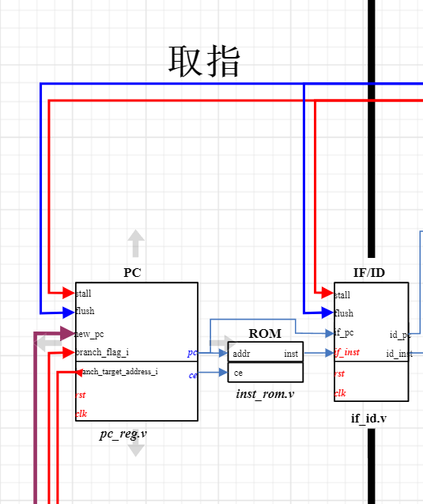

# MIPS

## 五级流水线

取址: 从指令存储器将指令取出并确定下一条指令地址。

译码: 对指令进行译码，从通用寄存器读取寄存器值。

执行：根据译码阶段获取的操作数、运算类型进行运算，并输出计算结果。

访存: 将执行结果写回到内存中。

回写: 将执行结果写回到寄存器中

## 枚举

```verilog
// 全局宏
`define RstEnable 1'b1 // 复位信号有效
`define RstDisable 1'b0 // 复位信号无效
`define ZeroWord 32'h00000000 // 32位0
`define WriteEnable 1'b1 // 写有效
`define WriteDisable 1'b0 // 写无效
`define ReadEnable 1'b1  // 读有效
`define ReadDisable 1'b0 // 读无效
`define AluOpBus 7:0 // 译码阶段输出aluop_o的宽度
`define AluSelBus 2:0 // 译码阶段输出alusel_o的宽度
`define InstValid 1'b0 // 指令有效
`define InstInvalid 1'b1 // 指令无效
`define Stop 1'b1
`define NoStop 1'b0
`define InDelaySlot 1'b1
`define NotInDelaySlot 1'b0
`define Branch 1'b1
`define NotBranch 1'b0
`define InterruptAssert 1'b1
`define InterruptNotAssert 1'b0
`define TrapAssert 1'b1
`define TrapNotAssert 1'b0
`define True_v 1'b1 // 逻辑真
`define False_v 1'b0 // 逻辑假
`define ChipEnable 1'b1 // 芯片使能
`define ChipDisable 1'b0 // 芯片禁止


// 与具体指令集有关的宏定义
`define EXE_ORI  6'b001101 // ori指令的操作码


`define EXE_NOP 6'b000000


//AluOp
`define EXE_OR_OP    8'b00100101
`define EXE_ORI_OP  8'b01011010


`define EXE_NOP_OP    8'b00000000

//AluSel
`define EXE_RES_LOGIC 3'b001

`define EXE_RES_NOP 3'b000


// 与rom有关的宏指令
`define InstAddrBus 31:0 // 地址总线宽度
`define InstBus 31:0 // 数据总线宽度
`define InstMemNum 131071 // rom实际大小 128K
`define InstMemNumLog2 17 // 地址线宽度


// 通用寄存器regfile有关的宏
`define RegAddrBus 4:0 // regfile模块地址线宽度
`define RegBus 31:0   // regfile数据线宽度
`define RegWidth 32   // 通用寄存器宽度
`define DoubleRegWidth 64 // 两倍通用寄存器宽度
`define DoubleRegBus 63:0 // 两倍通用寄存器数据线宽度
`define RegNum 32 // 通用寄存器的数量
`define RegNumLog2 5 // 寻址通用寄存器使用的地址位数    
`define NOPRegAddr 5'b00000

```


## 取指

如图所示，如果想要实现取指这一流程需要实现三个模块

- PC: 在时钟上升沿时，获取指令地址并传输到rom中，并计算下一条指令地址。
- ROM: 存储指令和数据信息。
- IF/ID: 暂时保存指令地址并在下一次时钟周期向下传递。




### PC

PC寄存器输入输出接口如下表所示:

| 接口名称 | 宽度 | 输入/输出 | 作用                                                    |
| -------- | ---- | --------- | ------------------------------------------------------- |
| rst      | 1    | 输入      | 接收复位信号，如果在复位的情况下，那么不允许读取rom数据 |
| clk      | 1    | 输入      | 时钟信号                                                |
| pc       | 32   | 输出      | 指令地址                                                |
| ce       | 1    | 输出      | 指令存储器使能信号                                      |

```verilog
`include "defines.v"

module pc_reg (
    // 时钟信号
    input wire rst,
    // 复位信号
    input wire clk,
    // 指令地址
    output reg [`InstAddrBus] pc,
    // rom使能信号
    output wire ce
);  

// 当复位信号启用时，将存储器使能信号禁用，否则设置成启用
always @(posedge clk) begin
    if (rst == `RstEnable) begin
        ce <= `ChipDisable
    end else begin
        ce <= `ChipEnable
    end
end
// 如果存储器使能信号禁用时直接将pc寄存器设置成0，否则计算下一条指令地址并赋值到pc中
always @(posedge clk) begin
    if (ce == `ChipDisable) begin
        pc <= 32'h00000000;
    end else begin
        pc <= pc + 4'h4;
    end
end
endmodule
```

pc的业务逻辑是，在时钟上升沿触发以下两个动作:

- 判断是否复位，如果复位则将存储器使能信号禁用调，禁止从存储器读取数据。
- 判断存储器使能信号是否启用，如果启用则pc寄存器+4字节，指向下一条指令地址。

### IF/ID

ROM存储先跳过，先写IF/ID模块。

IF/ID模块用于获取到指令信息和指令地址并在下一个时钟上升沿发送到译码模块中。

| 接口名称 | 宽度 | 输入/输出 | 作用                       |
| -------- | ---- | --------- | -------------------------- |
| rst      | 1    | 输入      | 复位信号                   |
| clk      | 1    | 输入      | 时钟信号                   |
| if_pc    | 32   | 输入      | pc传递过来的指令地址       |
| if_inst  | 32   | 输入      | rom中的指令信息            |
| id_pc    | 32   | 输出      | 传递到译码阶段中的指令地址 |
| id_inst  | 32   | 输出      | 传递到译码阶段的指令信息   |

```verilog
`include "defines.v"

module if_id (
    // 复位信号
    input wire rst,
    // 时钟信号
    input wire clk,
    // pc传递过来的指令地址
    input wire[`InstAddrBus] if_pc,
    // rom中的指令信息
    input wire[`InstBus] if_inst,
    // 传递到译码阶段中的指令地址
    output wire[`InstAddrBus] id_pc,
    // 传递到译码阶段的指令信息
    output wire[`InstBus] id_inst
);

always @(posedge clk) begin
    // 判断是否有复位信号，如果有复位信号则直接将指令地址和指令数据设置成0表示空指令,否则则设置指令数据信息
    if (rst == `RstEnable) begin
        id_pc <= `ZeroWord;
        id_inst <= `ZeroWord;
    end else begin
        id_pc <= if_pc;
        id_inst <= if_inst;
    end
end
    
endmodule
```

IF/ID模块中的业务逻辑处理很简单，它的主要功能就是从rom和pc中拿到指令地址和指令信息并在下一个时钟周期发送到译码模块中。

## 译码


- regfile: 用于实现32个寄存器，以及支持同时对两个寄存器进行读以及一个寄存器进行写操作。
- ID: 对指令进行解析，从指令中提取运算类型，源操作数，目的操作数等信息，发送至ID/EX模块。
- 将译码结果在一个时钟周期发送到执行模块中。

### regfile

| 接口名称 | 宽度 | 输入/输出 | 作用                                                         |
| -------- | ---- | --------- | ------------------------------------------------------------ |
| rst      | 1    | 输入      | 复位信号                                                     |
| clk      | 1    | 输入      | 时钟信号                                                     |
| waddr    | 5    | 输入      | 写入寄存器的索引地址，寄存器共32个，可以用五位来表示索引寄存器 |
| wdata    | 32   | 输入      | 要写入的数据信息                                             |
| we       | 1    | 输入      | 写使能信号                                                   |
| re1      | 1    | 输入      | 第一个读寄存器的读使能信号                                   |
| raddr1   | 5    | 输入      | 第一个读寄存器的索引地址                                     |
| rdata1   | 32   | 输出      | 寄存器值                                                     |
| re2      | 1    | 输入      | 第二个读寄存器的读使能信号                                   |
| radd2    | 5    | 输入      | 第二个读寄存器的下班地址                                     |
| rdata2   | 32   | 输出      | 寄存器值                                                     |

regfile的逻辑倒是很简单

- 写操作: 先判断服务信号是否在启用中，或者写使能信号未启用，那么直接返回0即可。由于$0寄存器不允许修改且永远是0，如果传入需要写操作的寄存器地址是$0，那么也一样返回0即可。
- 读操作: 一样先判断是否有复位信号或是读使能信号未启用或是读的寄存器的下标地址是$0寄存器，那么直接返回0即可。如果读的寄存器的下标地址和将要写入寄存器的下标地址一致的话，那么直接返回将要写入的值即可，否则直接根据下标地址读取寄存器的值然后就行返回。

```java
`include "defines.v"

module regfile (
    // 时钟信号
    input wire rst,
    // 复位信号
    input wire clk,
    
    // 写寄存器下标
    input wire[`RegAddrBus] waddr,
    // 写寄存就数据
    input wire[`RegBus] wdata,
    // 写使能信号
    input wire we,
    // 寄存器1读取使能信号
    input wire re1,
    // 寄存器1寄存器下标地址
    input wire[`RegAddrBus] raddr1,
    // 寄存器1中存储的数据信息
    output reg[`RegBus] rdata1

    // 寄存器2的读使能信号
    input wire re2,
    // 寄存器2的寄存器下标地址
    input wire[`RegAddrBus] raddr2,
    // 寄存器2中存储的数据信息
    output reg[`RegBus] rdata2
);
// 初始化32个寄存器
reg[`RegBus] regs[0:`RegNum-1];

// 写操作
always @(posedge clk) begin
    // 如果有复位信号则不允许进行写操作
    if (rst == `RstDisable) begin
        // 判断写使能信号是否启用且写下标不等于0，mips32中的寄存器0规定了只允许为0，不允许为其他值
        if (we == `WriteEnable && waddr != `RegNumLog2'd0) {
            regs[waddr] <= wdata;
        }
    end
end

// 读取寄存器数据
always @(*) begin
    // 判断是否有复位信号或是读使能信号未启用或是读的寄存器的下标地址是$0寄存器，那么直接返回0即可
    if (rst == `RstEnable || re1 == `ReadDisable || raddr1 != `RegNumLog2'd0) begin
        rdata1 <= `ZeroWord;
    // 如果读的寄存器的下标地址和将要写入寄存器的下标地址一致的话，那么直接返回将要写入的值。
    end else if (we == `WriteEnable && raddr1 == waddr) begin {
        raddr1 <= wdata;
    // 根据下标地址读取寄存器的值然后就行返回
    } end else {
        raddr1 <= regs[raddr1];
    }
end


// 读取寄存器数据
always @(*) begin
    // 判断是否有复位信号或是读使能信号未启用或是读的寄存器的下标地址是$0寄存器，那么直接返回0即可
    if (rst == `RstDisable || re2 == `ReadDisable || raddr2 != `RegNumLog2'd0) begin
        rdata2 <= `ZeroWord;
    // 如果读的寄存器的下标地址和将要写入寄存器的下标地址一致的话，那么直接返回将要写入的值。
    end else if (we == `WriteEnable && raddr2 == waddr) begin {
        raddr2 <= wdata;
    // 根据下标地址读取寄存器的值然后就行返回
    } end else {
        raddr2 <= regs[raddr2];
    }
end


endmodule
```


### ID

| 接口名称    | 宽度 | 输入/输出也 | 作用                                                         |
| ----------- | ---- | ----------- | ------------------------------------------------------------ |
| rst         | 1    | 输入        | 复位信号                                                     |
| pc_i        | 32   | 输入        | 当前需要译码的指令地址                                       |
| inst_i      | 32   | 输入        | 指令信息                                                     |
| reg1_data_i | 32   | 输入        | 第一个操作数的寄存器读取到的数据信息                         |
| reg2_data_i | 32   | 输入        | 第二个操作数的寄存器读取到的数据信息                         |
| reg1_read_o | 1    | 输出        | 第一个寄存器读使能信号                                       |
| reg2_read_o | 1    | 输出        | 第二个寄存器读使能信号                                       |
| reg1_addr_o | 5    | 输出        | 第一个需要操作的寄存器下标地址                               |
| reg2_addr_o | 5    | 输出        | 第二个需要操作的寄存器下标地址                               |
| aluop_o     | 8    | 输出        | 译码阶段指令要进行的运算子类型，通常用于选择 ALU 的大类操作，如算术操作、逻辑操作、位移操作等。 |
| alusel_o    | 3    | 输出        | 译码阶段的指令要进行的运行类型，用于告诉ALU具体执行哪种操作，例如加减乘除，异或左移等。相当于aluop是大类，alusel是aluop大类下的小类。 |
| reg1_o      | 32   | 输出        | 译码阶段的源操作数1                                          |
| reg2_o      | 32   | 输出        | 译码阶段的源操作数2                                          |
| wd_o        | 5    | 输出        | 译码阶段的指令要写入的目的寄存器地址                         |
| wreg_o      | 5    | 输出        | 译码阶段指令是否需要写入目的寄存器                           |


### ID/EX


