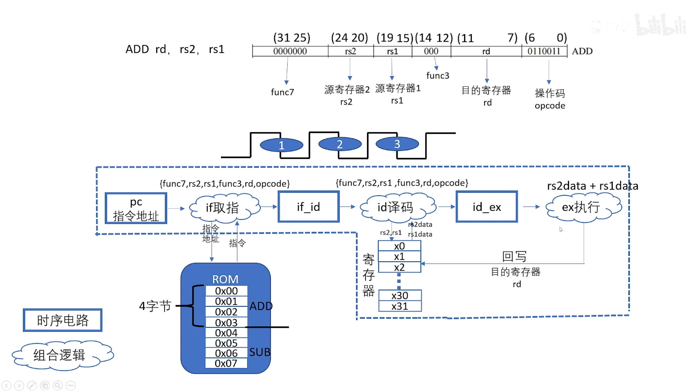
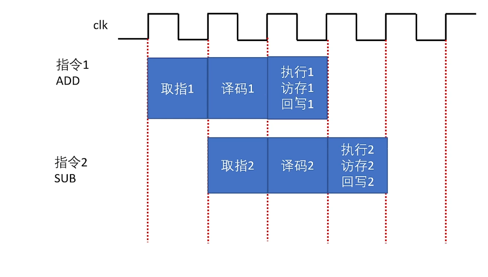
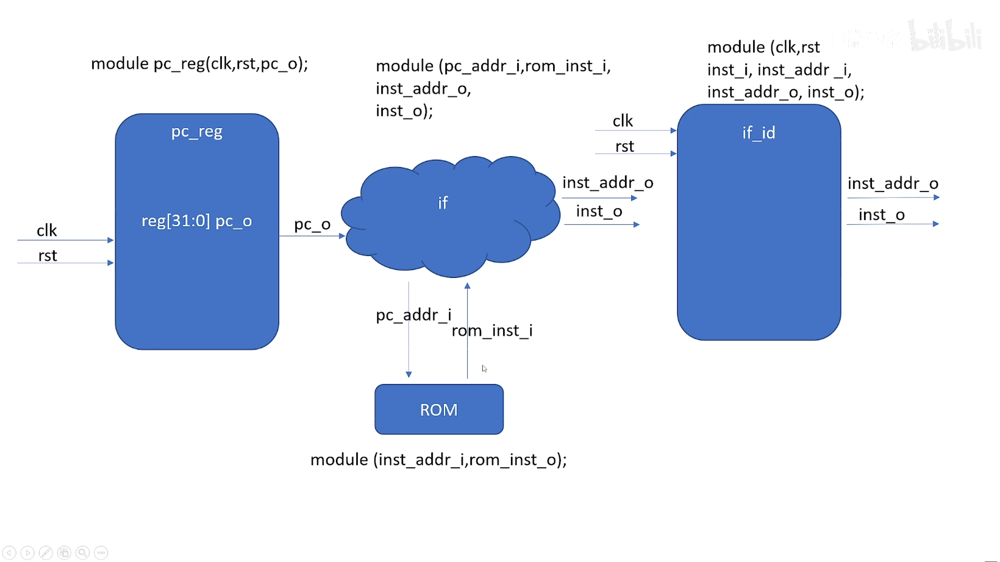

# Risc-V

	## CPU基本模块

在虚线中我们实现了三级流水线，虚线中的方框表示时许电路，在时钟上升沿进行执行，而云状的则是组合逻辑，当数据输入到组合逻辑中，那么就会立即输出出去。

在rom中存储指令和数据信息，例如add命令有四个字节，顺序从上到下在rom中占有四个内存地址空间。

pc中存储着当前执行指令的内存地址，pc模块将指令地址发送到取值模块中，取值模块根据pc指令地址将指令将指令取出来发送到if_id模块中，if_id将指令信息存储到寄存器中。

译码模块会对指令进行译码，例如我们的add指令，将根据寄存器的地址并将数据从寄存器中读取出来，将数据发送到id_ex寄存器中，然后由执行模块读取之前读出的寄存器人然后进行执行，执行完成回写到目的寄存器中。

实际三级流水线执行的过程如下图所示，由于不能同时从pc寄存器中获取指令，所以上一条指令与下一条指令会错过一个时钟周期来执行。

## PC

