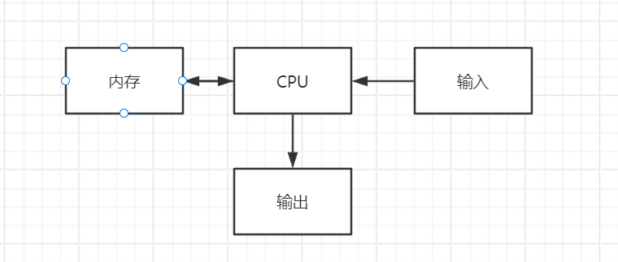
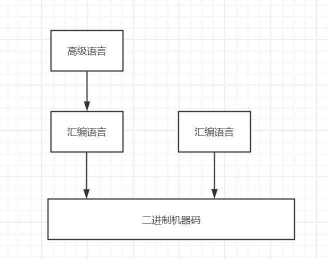
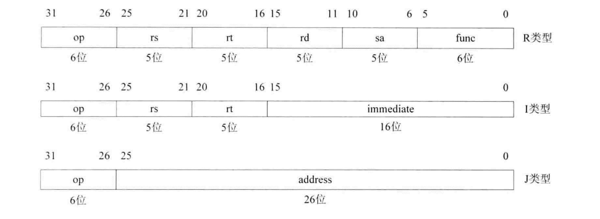
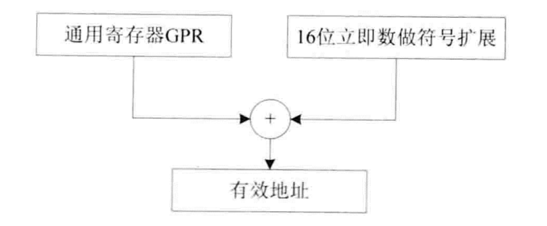
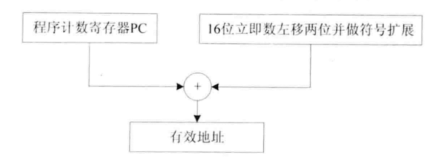
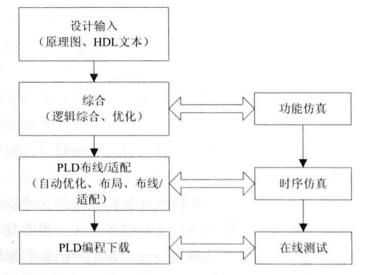
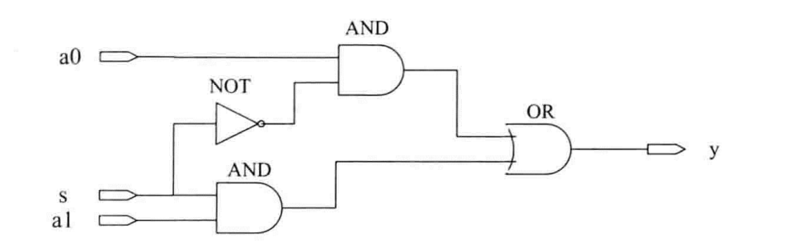

# 处理器与MIPS

## 计算机组成模型

冯诺依玛架构的计算机组成有四部分组成，分别是内存、CPU、输入、输出，用户通过输入设备将数据输入到计算机中，经过CPU计算后由输出设备输出给到用户，CPU在进行处理时会从内存单元中获取指令，然后进行执行，执行完成后CPU再写回到内存中去，如下图所示:



我们在日常使用计算机处理各种业务时，在CPU看来就是一系列二进制机器码，通过机器码的不同排列组合，来实现各种不同的业务功能。开发人员可以直接使用机器码来进行编程，但是由于机器码太过反人类，在进行编程的过程中，其中一位0写成了1，在debug起来也不太容易，为了解决这个问题，汇编语言应运而生，通俗的讲，汇编语言就是机器语言的助记符，将一组二进制机器码翻译为一个汇编指令，程序员在开发的过程中就不需要记忆各种繁杂荣誉的二进制代码，直接使用汇编语言进行编程即可。开发人员使用汇编指令编程程序后，之后再由汇编器将汇编指令转换成二进制机器语言，这样一来CPU就可以执行了。虽然汇编语言解决了机器语言的问题，但是如果想要使用汇编语言来完成一个计算机程序，耗费的成本虽然不如直接使用机器语言编写要大，但是要耗费的成本也是巨大的，不但要了解计算机的各种寄存器，还得需要学习一系列复杂的汇编指令，汇编指令的代码量也非常的多，为了解决这个不足，于是高级语言变诞生了，高级语言相较于汇编语言，起码对于人来说，更加易于开发人员理解了。开发人员在编写完成高级语言源代码后，经过高级语言编译器将高级语言翻译成汇编指令，在由汇编器将汇编指令翻译成二进制机器码，最终再由CPU执行，如下图所示:



## 架构与指令集

指令集架构(Instruction Set Architecture,ISA)定义了CPU硬件要实现的功能，类似软件开发的需求规格说明书，在指令集架构中定义了一些系统规范，例如CPU寄存器的名称，指令操作数的格式等等。

微架构是指令集的实现，不同的CPU有不同的微架构，即便硬件不同，只要它们使用的是同一ISA，那么它们编写出来的软件都是通用的。

这种编程思想类似于计算机的七层模型，上层是下层的抽象，下层是上层的实现。

### 复杂指令集和精简指令集

从大的方面，指令集可以分为两种，分别是复杂指令集(Complex Instruction Set Computer, CISC)和精简指令集(Reduced Instruction Set Computer, RISC)。

在早期，由于存储设备比较昂贵，为了减少访问内存的次数，程序员将指令集的功能就设计的非常强大，往往一条指令就可以实现许多基本功能。复杂指令集类似高级编程语言中的函数，将多种操作封装成一个函数，复杂指令集也类似，将多个底层机器指令封装成一个复杂指令集。在实际使用过程中，常用的指令集只占总指令集的20%，剩余80%的指令集不经常使用，显而易见这样肯定是不合理的，所有需要将剩余80的硬件进一步精简，将最常用的指令集精简出来，不常用的硬件和指令集就可以省略掉了。

### MIPS



MIPS 32分为三种指令类型

- R类型:  用于操作寄存器，将两个源寄存器的计算结果存储到目的寄存器中。
  - op: 指令码，在R类型中一般是000000。
  - func: 功能码，表示指令具体功能。
  - rs: 源寄存器
  - rt: 源寄存器
  - rd: 目的寄存器
  - sa: 移位寄存器，只有在移位运算的时候才会用到
- I类型: 寄存器 + 内存地址中存储的数据的计算结果存储到另一个寄存器中。16位没办法获取32位的地址，那么就利用基地址 + 16位编译找到真实地址进行间接寻址即可。
  - IMEDIATE: 立即数
- J类型: 跳转到指定地址中

### 寻址方式

#### 寄存器相对寻址

基址寄存器 + 16位立即数偏移找到真实有效地址。



#### PC相对寻址

类似寄存器相对寻址，将PC寄存器中存储的值当基址，然后 + 16位立即数计算出真实有效的地址。



### 协处理器CP0

主要负责处理与系统控制和管理相关的任务。

# 可编程逻辑器件和Verilog HDL

## PLD设计流程



### 设计输入

尽管PLD的物理硬件资源是固定的，但其灵活的配置能力使其可以实现多种不同的逻辑功能。通过改变配置文件，开发者可以在同一个PLD上实现不同的设计。这种可编程能力使得PLD在应用中非常灵活和多功能，可以用于快速原型设计、动态配置和复杂逻辑实现。硬件是固定的，但是内部硬件资源是可配置的，根据不同的配置可以实现不同的硬件功能。

#### 原理图输入

用原理图来表述硬件接线情况，原理图对于用户来说更加直观一些，如下图，a0、s、a1是三个输入，y为输出。AND表示两个与运算，输入两边都为1结果才为1，NOT表示非运算，0输入会变成1，1输入会变成0。or表示两个输入其中一个输入为1则结果为1。下图的原理图的功能如下:

- s = 0, a0 = 1时，y = 1
- 当 s = 1, s = 1时， y = 1 
- 否则y  = 0



#### HDL文本输出

硬描述语言来描述具体电路的实现，然后根据相应的工具变成指定目标文件，最终下载到PLD器件中，实现具体的电路。以下是根据原理图设计的Verilog HDL的代码

```verilog
module mux2(a0, a1, s, y) (
    input s, a0, a1;
    output y;
    assign y = s ? al : a0
);
endmodule
```

#### 综合

将高级抽象的代码转换成芯片可阅读执行的低层次电路网表。


#### 布局布线


#### 下载

#### 仿真
