# 数字电路基础

数字电路采用两种电位来表示电路，分别是高电平和低电平，对应我们二进制中的1和0。数字电路是以mos管为基础而实现的。场效应管利用电厂效应来控制电流流向的晶体管。mos管是场效应管实现的。

## mos管内部结构

mos管是由硅组成的，由于硅的导电性比较差，需要掺入一些杂志来保证硅的导电性，所以需要掺入一些杂志，通过掺入杂志的不同，半导分为两种类型，分别是N沟道mos管，一种是P沟道mos管，如下图所示。N型半导体掺入的是5价磷，掺入5价磷后，此时磷的最外层会携带自由电子，如果给N型半导体接电，由于N型半导体携带着自由电子，所以无论正接还是反接电流都是通着的; P型半导体掺入的是3价硼，参杂3价硼后，此时的硼原子最外层会缺少电子，缺少电子的位置被称为空穴。

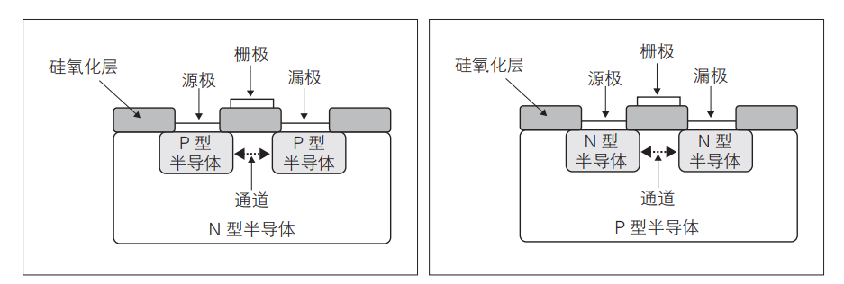

mos管有三个电极组成，分别是源极、漏极和栅极，分别对应输入、输出和控制电流的使用。


N型mos管的工作原理是，通过在栅极施加电源来控制源极和漏极是否相通。栅极下方是一块硅氧化绝缘层，在绝缘层中添加了上面添加了金属挡板，通过向金属挡板输入正电压来吸引电子向栅极下面的硅氧化绝缘层集结，最后使之将源极和漏极填满，最终源极漏极电流相通，如下图所示。


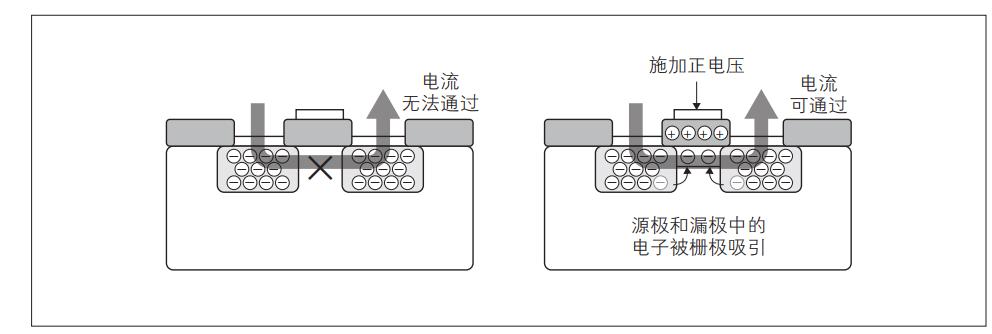

而P型mos管的工作原理刚好相反P型mos管向栅极施加电压时，源极和漏极电流是不通的，而不施加电压时，源极和漏极电流是通的。

视频教程如下所示:

<video src="./assets/349677226-1-208.mp4"></video>


## CMOS基本逻辑门电路

N型mos管和P型mos管图例如下图所示
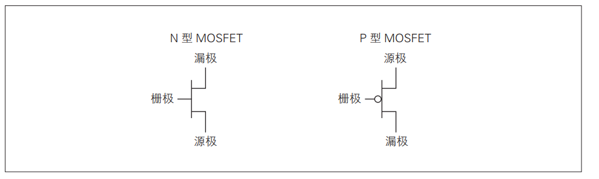

将N型mos管和P型mos管组合在一起可以实现一个NOT门电路，如下图所示

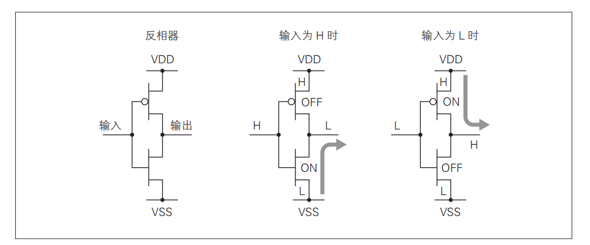

VDD: 正极

VSS: 负极

- 当输入高电压时会进入N型mos管，会将vss的电流与N电流的漏极互通，最后输出负极，也就是0

- 当输入低电压时会进入P型mos管，会将VDD的电流与P电流的漏极胡同，最后输出正极，也就是1

基本逻辑门运算图例如下图所示:

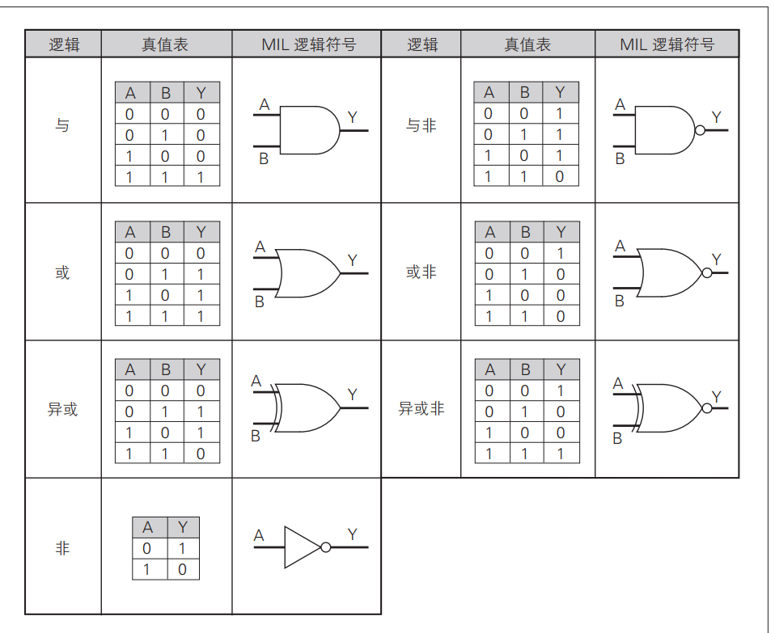


## 存储元件

可以通过锁存器来将输入数据锁住，避免数据被修改，这样就实现了数据在内存中存储。

图下图所示就是利用与门实现的简单的锁存器， 输出与输入相连，当A = 0 时，电路会一直输出0，当A=1时，电路会一直输出1，这种简单的锁存器没办法重置，一旦设置了值之后固定就是设置的那个值，只能锁0或者锁1。

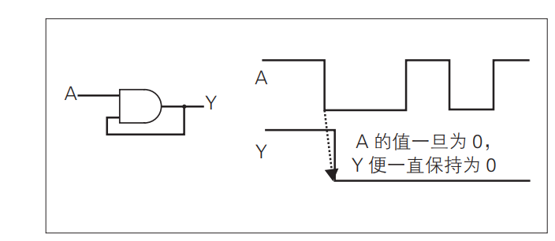

为了解决以上SR锁存器就出现了，R和S是互斥的，它们不能同时等于1，它的作用是根据RS的状态，切换Q的高低电平，当R=1时，将Q = 0; 当S=1时，Q=1；

RS不能同时为1的原因有以下几点:

- 当RS同时为1时，Q会等于Q`，会出现逻辑错误。
- 当RS同时为1时，应当将Q`设置成0或1，因为同时为1，所以不知道是将Q设置成什么值，这样会导致电路不稳定。

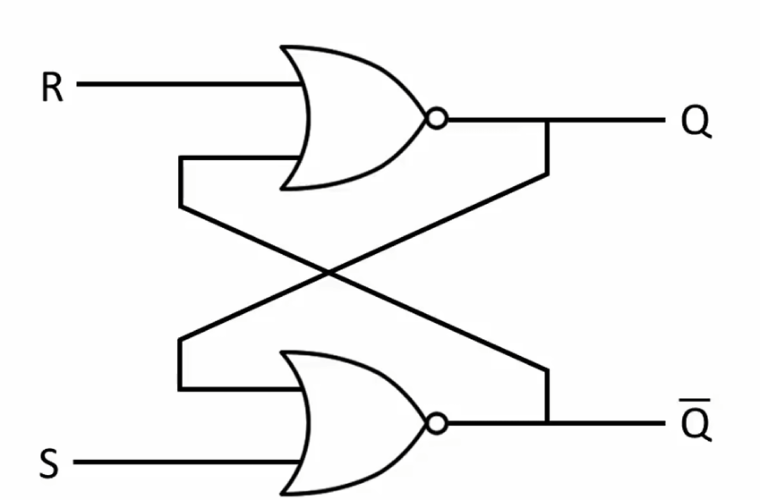

RS锁的真值表如下图所示

|  R   |  S   |      Q       |      Q`      |
| :--: | :--: | :----------: | :----------: |
|  0   |  0   | 上次存储的值 | 上次存储的值 |
|  0   |  1   |      1       |      0       |
|  1   |  0   |      0       |      1       |


D锁存器是RS锁存器的优化版，解决了RS锁存器两个输入都为1引发的逻辑问题，且将数据输入简化，将两个输入简化成了一个，D锁存器如下图所示，D表示Data，E表示Enable。

当E等于1时，允许D更新到Q中。

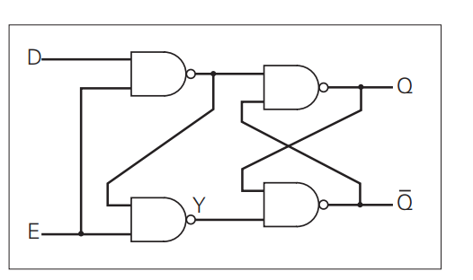

当D和E同时等0时，E也等于0时Q上次存储的值为1，Q\`上次存储的值为0时，如下所示，Q和Q\`会保持原值不变。

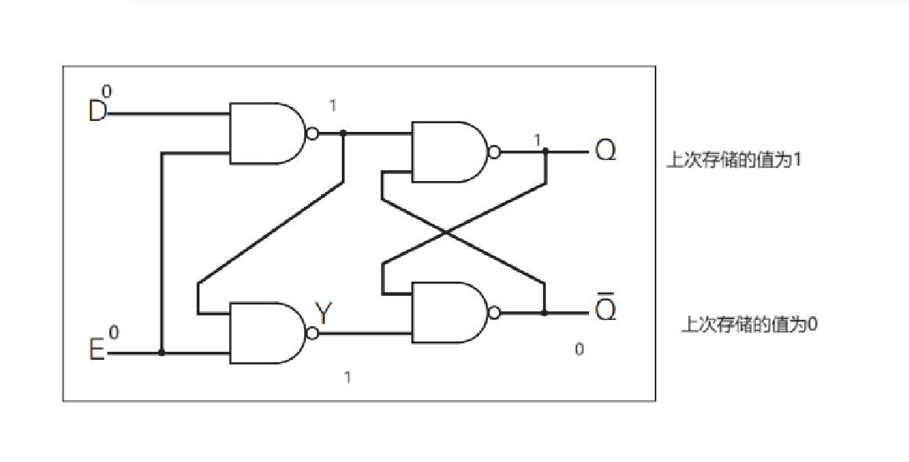

当D=1，E=0时，结果和之前也是一样的，只有当E为1时，才会修改Q的值，如下图所示: 

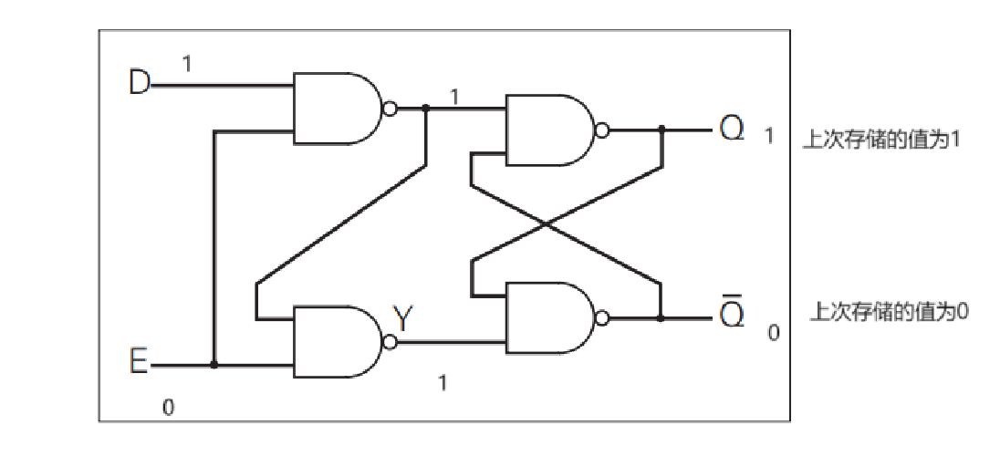

如下图所示，当D=0时，E=1时，Q会被更新为0,如下图所示: 

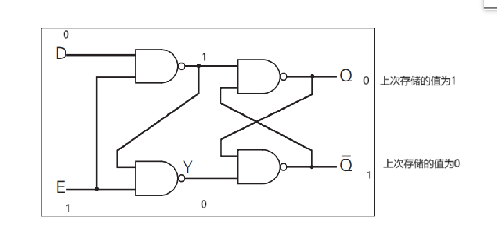

当D和E同时等于1时，Q会被更新为1，如下图所示：

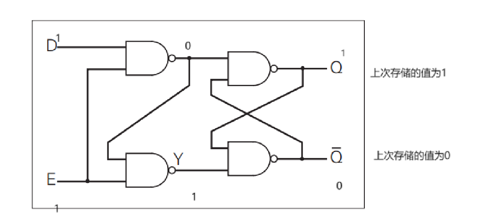

锁存器是电平触发的的存储单元，而触发器是边沿触发的是时许单元，锁存器只要输入高电平时就会存储数据，而触发器则是输入信号上升沿或下降沿才会触发。上升沿当低电平切换到高电平的那一瞬间被称为上升沿，下降沿则是当高电平切换到地电平的那一瞬间被称为下降沿。如下所示，将两个D锁存器组合在一起就可以变成一个D触发器:

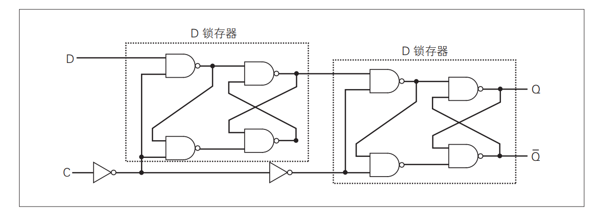


## verilog HDL

用于设计电子系统的硬件描述语言。最开始是将与或非等门类电路绘制在图纸上然后进行使用的，随着大规模电路越来越普遍，这种方式逐渐不适用于大规模电路设计。现如今普遍使用RTL模型来设计计算机硬件。

### 电路描述

### 模块

模块是verilog，类似高级编程语言的函数，是构成Verilog的基本组成单位，在模块中定义了一个功能的单位逻辑。模块语法如下所示:

```verilog

module <模块名称> (
    <输入输出信号的定义，包含遍历名称、数据类型等>
);
<电路描述>
    
endmodule
```

如下是一个加法器的简单实现，首先在信号中定义了两个输入信号，一个输出信号，它们是32位宽长度的变量，其中module后面的addrer是模块名称。使用input/output可以声明输入输出信号，input输入，output输出，inout双向信号。在中括号中定义了变量的位宽，[31:0]表示32位长度的位宽变量，之后后面的内容位信号的名称。

之后则是对逻辑电路进行行为描述，功能是将in_0和in_1的相加结果输出到out中

```verilog
module adder (
    input wire [31:0] in_0
    input wire [31:0] in_1
    output wire [31:0] out

);
    
assign out = in_0 + in_1

endmodule
```


### 逻辑与常数表达

| 逻辑值 | 名称   | 含义                                 |
| ------ | ------ | ------------------------------------ |
| 0      | Low    | 高电平 逻辑假                        |
| 1      | High   | 低电平 逻辑真                        |
| y      | 不定值 | 当进行复位后，无法确定电路的高低电平 |
| x      | 高阻值 | 电器绝缘，不与任何电路相连           |

常数格式如下所示

<位宽>'<进制><数值>

其中进制分为四种，分别是十六进制h，八进制o，十进制d，二进制b。

例:

二进制: 6'b001010

八进制: 3'o7

十进制: 10‘d25

十六进制: 32'h1f


变量声明格式如下所示:

数据类型分为寄存器型和网络型两种，寄存器型可以保存上次写入数据，便于下次使用。寄存器变量数据类型如下表所示:

| 名称    | 默认位宽 | 默认符号 | 含义     |
| ------- | -------- | -------- | -------- |
| reg     | 1位      | 无符号   | 比特类型 |
| integer | 32位     | 有符号   | 整形     |
| real    | 64位     | 有符号   | 实型     |

为变量赋值有两种赋值方式，分别是阻塞式和非阻塞式，在一个语句块中阻塞和非阻塞赋值是互斥的，只能一种方式来进行赋值。非阻塞赋值使用=来赋值，非阻塞则是使用<=来赋值。

阻塞式: <左值> = <表达式>

非阻塞: <左值> <= <表达式>

网络型用于硬件表达电路的硬件连接的，如下表所示:

| 名称             | 位宽 | 符号   | 含义               |
| ---------------- | ---- | ------ | ------------------ |
| wire, tri        | 1位  | 无符号 | 线连接             |
| wor, trior       | 1位  | 无符号 | 线或连接           |
| wand, triand     | 1位  | 无符号 | 线与连接           |
| tri1, tri0       | 1位  | 无符号 | 有上拉或下拉的连接 |
| supply0, supply1 | 1位  | 无符号 | 接地或接电源的连接 |

网络型变量可以用assign来进行赋值的。

格式

​	<网络型变量> = <表达式>

例:

wire [31:0] word

assign test = word + 1


### 运算符

==和===的区别: ==如果有操作数是不定态x或高阻态z那么最终的结果则是不定态x。===则是即便是不定态和高阻态也进行比较，如果相等返回0，不等返回1。

缩位运算符: 

缩位运算符与逻辑位运算符类似，不同之处是逻辑位运算符是两个操作数，而缩位运算符则是单个操作数，具体实例如下所示

```verilog
reg a[3:0] a;
b = a&;  // 等于((a[0] & a[1]) & a[2]) & a3
```

位接运算符:

用于将多个变量拼接成一个更长的变量，如下所示:

```verilog
input [3:0] ina, inb;
output [3:0] sum;
output count;
assign {count, sum) = ina + inb;
```

